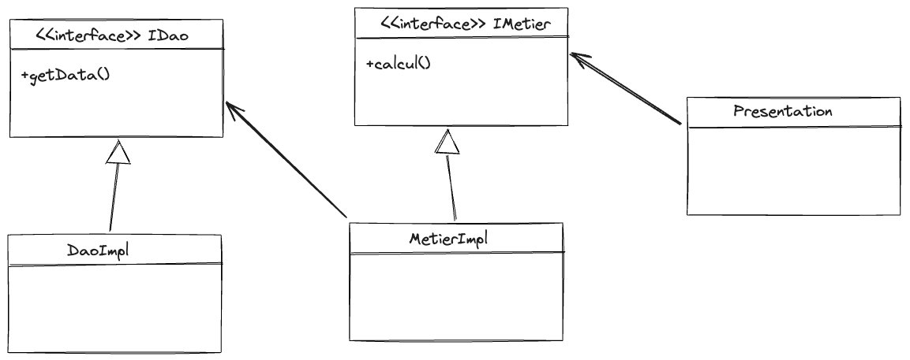

## Introduction
Toute application moderne nécessite l'évolutivité, en appliquant les principes de la fermeture aux modifications et l'ouverture aux extensions.
Cela signifie que les applications doivent être conçues pour être modifiées sans avoir à modifier le code source.

## Énoncé
Dans le cadre de ce TP, on doit implémenter le concept de l'injection des dépendances de manières statique et dynamique
- La méthode statique consiste à injecter les dépendances directement dans le constructeur de la classe
- La méthode dynamique consiste à injecter les dépendances à travers
  - Un fichier de configuration
  - Spring Framework (XML, Annotation)
## Conception
### Diagramme de classe


## Code Source
### Interface `IDao`
```java
public class IDao {
    public void getData();
}   
```

### Implémentation de l'interface `IDao`
```java
public class DaoImpl implements IDao {
    @Override
    public void getData() {
        return 42.0;
    }
}
```

### Interface `IMetier`
```java
public class IMetier {
    public void calcul();
}
```

### Implémentation de l'interface `IMetier`
```java
public class MetierImpl implements IMetier {
    
    private IDao dao;

    @Override
    public double calcul() {
        double data = dao.getData();
        return data * Math.PI;
    }
}
```

### Injection des dépendances de manière statique
```java
public class PresStatic {
    public static void main(String[] args) {
        IDao dao = new DaoImpl();
        IMetier metier = new MetierImpl(dao);
        System.out.println(metier.calcul());
    }
}
```

### Injection des dépendances de manière dynamique
#### Injection des dépendances à travers des annotations à travers un [fichier texte](./src/main/resources/config.txt)
```java
public class PresDyn {
    public static void main(String[] args) throws Exception {
        Scanner sc = new Scanner(new File("./src/main/resources/config.txt"));

        String daoClassName = sc.nextLine();
        Class<?> cDao = Class.forName(daoClassName);
        IDao dao = (IDao) cDao.getConstructor().newInstance();
        System.out.println(dao.getData());

        String metierClassName = sc.nextLine();
        Class<?> cMetier = Class.forName(metierClassName);
        IMetier metier = (IMetier) cMetier.getConstructor().newInstance();
        cMetier.getMethod("setDao", IDao.class).invoke(metier, dao);
        System.out.println(metier.calcul());
    }
}
```

#### Injection des dépendances à travers des annotations
```java
public class PresAnnotation {
    public static void main(String[] args) {
        ApplicationContext ctx = new AnnotationConfigApplicationContext(AppConfig.class);
        IMetier metier = (IMetier) ctx.getBean("metier");
        System.out.println(metier.calcul());
    }
}
```

#### Injection des dépendances à travers un [fichier XML](./src/main/resources/applicationContext.xml)
```java
public class PresXML {
    public static void main(String[] args) {
        ApplicationContext ctx = new ClassPathXmlApplicationContext("applicationContext.xml");
        IMetier metier = (IMetier) ctx.getBean("metier");
        System.out.println(metier.calcul());
    }
}
```
